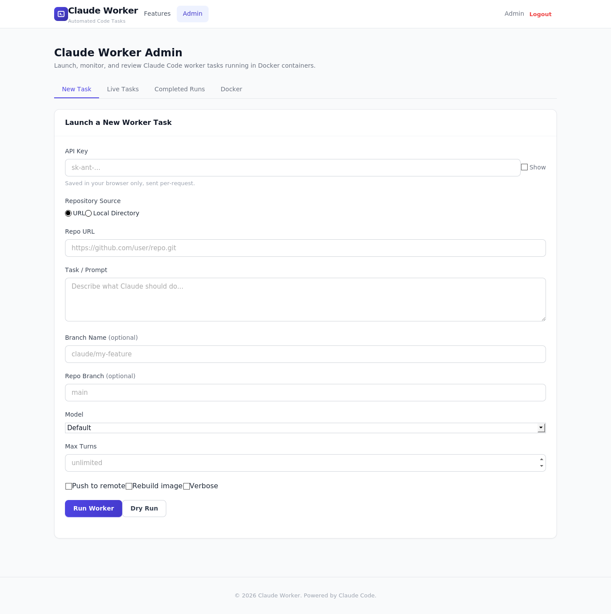
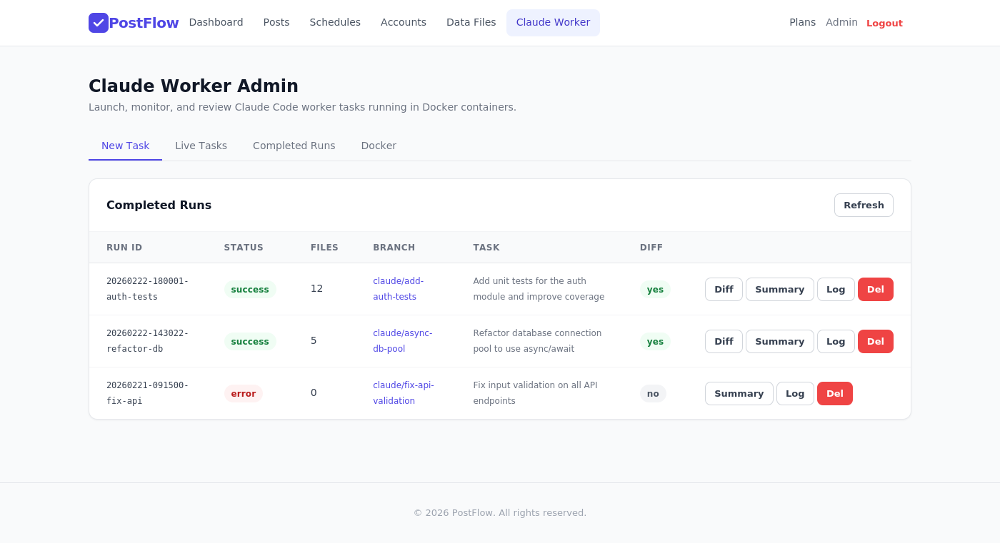
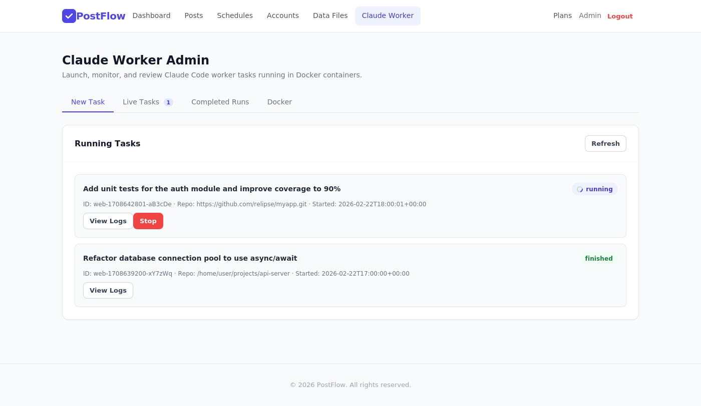
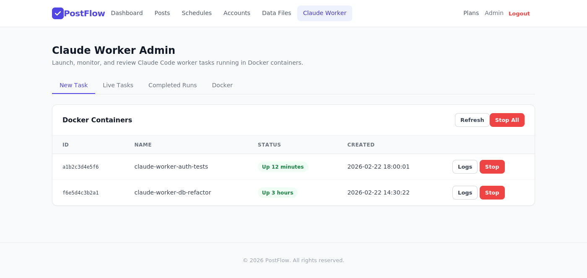
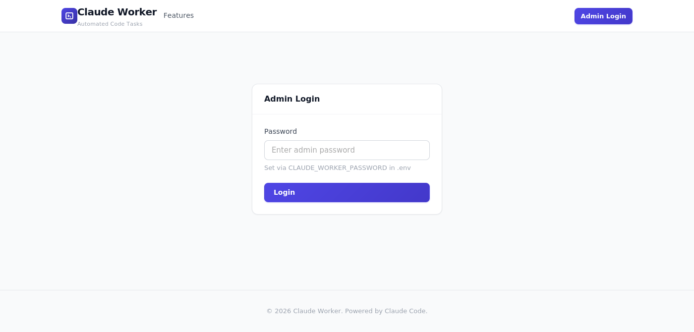
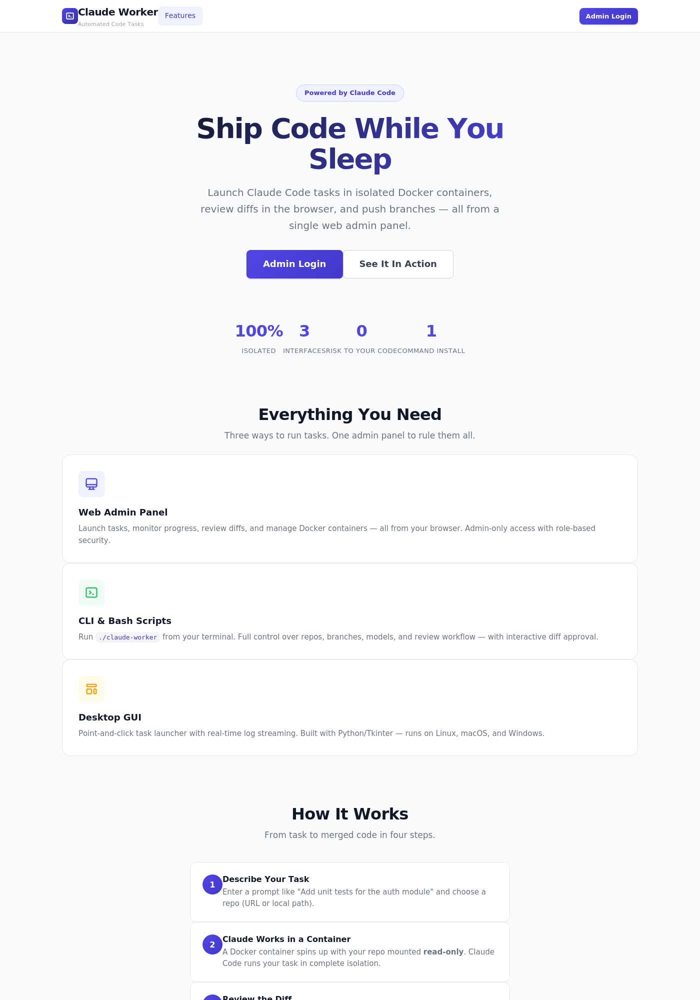
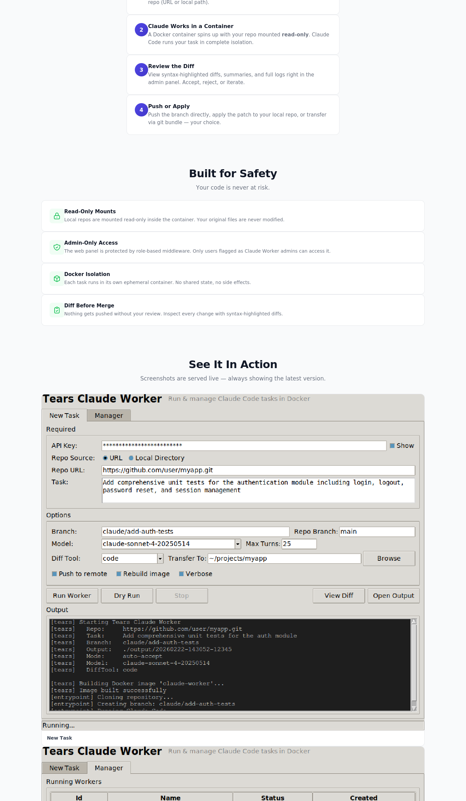
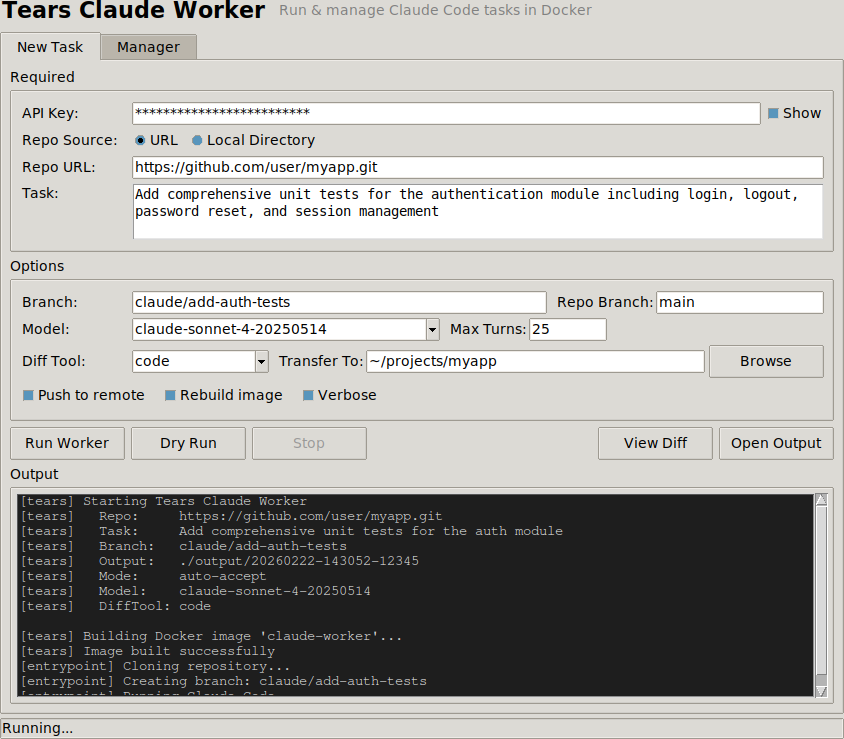
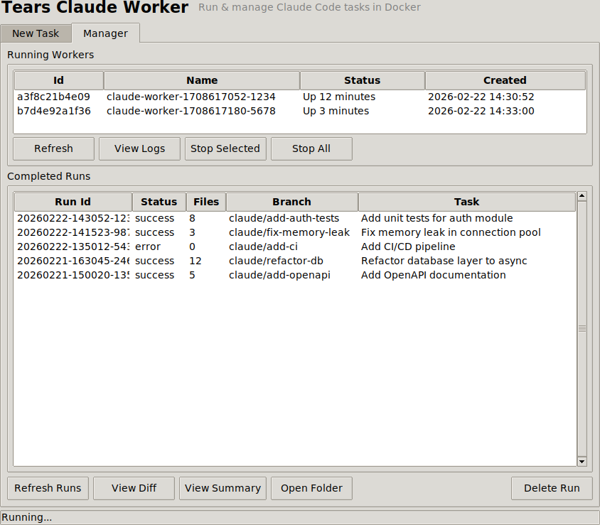
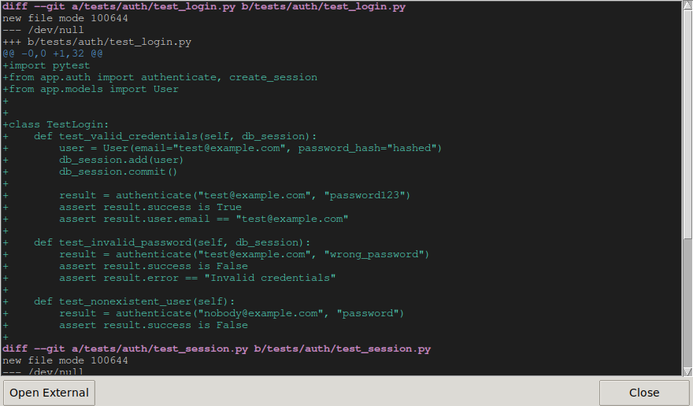

# Axono

Two projects in one Laravel codebase: **PostFlow** (social media scheduler) and **Tears Claude Worker** (automated code tasks in Docker).

---

## Tears Claude Worker

Run Claude Code tasks inside isolated Docker containers. Clone any git repo (or use a local one), give Claude a task, and get back a clean branch with diffs ready for review. Includes a CLI, a desktop GUI, a manager, and a web admin panel.

Works on macOS and Linux.

### Screenshots

#### Web Admin — New Task


#### Web Admin — Completed Runs


#### Web Admin — Live Tasks


#### Web Admin — Docker Containers


#### Admin Login


#### Marketing / Features Page



#### Desktop GUI — New Task


#### Desktop GUI — Manager


#### Desktop GUI — Diff Viewer


### How it works

```
┌──────────────────────────────────────────────────────────────┐
│  Host machine                                                │
│                                                              │
│  $ ./claude-worker --repo <url> --task "do something"        │
│  $ ./claude-worker --local-repo ~/myapp --task "add tests"   │
│       │                                                      │
│       ▼                                                      │
│  ┌───────────────────────────────────────────────────────┐   │
│  │  Docker container (isolated)                          │   │
│  │                                                       │   │
│  │  1. Clone repo (or copy local repo, read-only mount)  │   │
│  │  2. Create feature branch                             │   │
│  │  3. Run Claude Code (auto-accept or interactive)      │   │
│  │  4. Commit changes                                    │   │
│  │  5. Save diffs + git bundle to mounted volume         │   │
│  │                                                       │   │
│  └───────────────────────────────────────────────────────┘   │
│       │                                                      │
│       ▼                                                      │
│  Review prompt: [a]ccept / [r]eject / [v]iew / [d]iff tool   │
│                 [p]ush to remote / [t]ransfer to local repo   │
│       │                                                      │
│       ▼                                                      │
│  output/<run-id>/                                            │
│    ├── diffs/                                                │
│    │   ├── summary.txt       ← human-readable overview       │
│    │   ├── full.patch        ← complete unified diff         │
│    │   ├── stat.txt          ← diffstat                      │
│    │   └── per-file/         ← one .patch per file           │
│    ├── logs/                                                 │
│    │   ├── worker.log        ← full session output           │
│    │   └── claude-output.log ← Claude Code output            │
│    ├── repo.bundle           ← git bundle (for transfer)     │
│    ├── run-info.json         ← input metadata                │
│    └── run-result.json       ← result metadata               │
└──────────────────────────────────────────────────────────────┘
```

### Prerequisites

- [Docker](https://docs.docker.com/get-docker/) installed and running
- [Python 3](https://www.python.org/) (for the GUI and manager; Tkinter ships with Python)
- [PHP 8.2+](https://www.php.net/) & [Composer](https://getcomposer.org/) (for the web admin)
- An [Anthropic API key](https://console.anthropic.com/)

### Quick start

```bash
# 1. Set your API key
export ANTHROPIC_API_KEY="sk-ant-..."

# 2. Make scripts executable
chmod +x claude-worker/claude-worker claude-worker/claude-worker-gui claude-worker/claude-manager

# 3. Run a task (CLI)
./claude-worker/claude-worker \
    --repo https://github.com/user/myapp.git \
    --task "Add unit tests for the auth module"

# 4. Or use the GUI
./claude-worker/claude-worker-gui
```

### One-command install (Debian / Ubuntu)

The installer handles everything — PHP, Composer, Docker CE, SQLite, file permissions, database migrations, and web server config:

```bash
sudo ./claude-worker/install-debian.sh
```

What it installs (only if not already present):
- PHP 8.2+ with all required extensions
- Composer (latest)
- Docker CE + adds your user to the `docker` group
- SQLite
- Git, curl, unzip

It also detects Apache or Nginx and creates a virtual host config automatically. A random admin password is generated and shown at the end.

### Manual setup (any Linux / macOS)

```bash
# 1. Run the setup script (installs Laravel deps, configures DB, etc.)
./claude-worker/setup-server.sh

# 2. Set an admin password
php artisan claude-worker:password my-secret-password

# 3. Start the server
php artisan serve --host=0.0.0.0 --port=8000

# 4. Open in your browser
# http://your-server:8000/claude-worker/features
# Login at: http://your-server:8000/claude-worker/login
```

### CLI Usage

```
./claude-worker/claude-worker --repo <url> --task <prompt> [OPTIONS]
./claude-worker/claude-worker --local-repo <path> --task <prompt> [OPTIONS]
```

#### Required (one of)

| Flag | Description |
|------|-------------|
| `--repo <url>` | Git repository URL to clone |
| `--local-repo <path>` | Use a local repo (mounted read-only; changes on a copy) |
| `--task <prompt>` | Task / prompt for Claude Code |

#### Options

| Flag | Description | Default |
|------|-------------|---------|
| `--branch <name>` | Feature branch name | `claude/<slugified-task>` |
| `--repo-branch <name>` | Branch to clone from the repo | repo default |
| `--output <dir>` | Output directory for diffs/logs | `./output` |
| `--model <model>` | Claude model to use | API default |
| `--max-turns <n>` | Max agentic turns | unlimited |
| `--interactive` | Prompt before applying changes | off (auto-accept) |
| `--push` | Push the branch to the remote | off |
| `--transfer <path>` | Transfer branch into a local repo (via git bundle) | — |
| `--diff-tool <cmd>` | Open diffs in external tool (code, meld, vimdiff, etc.) | — |
| `--no-review` | Skip accept/reject prompt | off |
| `--rebuild` | Force rebuild the Docker image | — |
| `--verbose` | Detailed output | off |
| `--dry-run` | Show command without executing | — |

#### Environment variables

| Variable | Required | Description |
|----------|----------|-------------|
| `ANTHROPIC_API_KEY` | Yes | Your Anthropic API key |

### Web Admin Features

- **New Task tab** — configure repo, task, model, options and launch
- **Live Tasks tab** — monitor running tasks with real-time log streaming
- **Completed Runs tab** — browse finished runs, view diffs with syntax highlighting, summaries, and logs
- **Docker tab** — see running containers, view logs, stop them
- **API key stored in browser** — never saved on the server
- **Admin-only access** — protected by password-based login
- Works from any device with a browser (phone, tablet, laptop)

### Admin access

The Claude Worker panel is protected by a password. Set it via:

```bash
# Option 1 — Artisan command
php artisan claude-worker:password my-secret-password

# Option 2 — Environment variable in .env
CLAUDE_WORKER_PASSWORD=my-secret-password
```

Login at: `http://your-server:PORT/claude-worker/login`

### Web server config

#### Nginx

```nginx
server {
    listen 80;
    server_name your-domain.com;
    root /path/to/axono/public;

    index index.php;

    location / {
        try_files $uri $uri/ /index.php?$query_string;
    }

    location ~ \.php$ {
        fastcgi_pass unix:/var/run/php/php8.2-fpm.sock;
        fastcgi_param SCRIPT_FILENAME $realpath_root$fastcgi_script_name;
        include fastcgi_params;
    }

    location ~ /\.(?!well-known).* {
        deny all;
    }
}
```

#### Apache

```apache
<VirtualHost *:80>
    ServerName your-domain.com
    DocumentRoot /path/to/axono/public

    <Directory /path/to/axono/public>
        AllowOverride All
        Require all granted
    </Directory>

    SetEnvIf Authorization "(.*)" HTTP_AUTHORIZATION=$1
</VirtualHost>
```

Required Apache modules:

```bash
sudo a2enmod rewrite
sudo a2enmod headers
sudo systemctl restart apache2
```

### Security model

- Everything runs inside a Docker container — isolated from your host
- The container has no access to your SSH keys, credentials, or personal config
- Local repos are mounted read-only — your files are never modified
- The only output is diffs and git bundles saved to a mounted volume
- Auto-accept only applies inside the container

### Review prompt

After the worker finishes, you get an interactive prompt:

```
[tears] [a]ccept / [r]eject / [v]iew diff / [d]iff tool / [p]ush / [t]ransfer
```

| Key | Action |
|-----|--------|
| `a` | Accept changes (diffs saved) |
| `r` | Reject changes (diffs still saved for later) |
| `v` | View full diff in a pager (less) |
| `d` | Open in external diff/merge tool |
| `p` | Accept + push branch to remote |
| `t` | Accept + transfer branch into a local repo |

---

## PostFlow

A self-hosted social media scheduling app built with Laravel. Connect your Twitter, Facebook, and LinkedIn accounts, compose posts, and schedule them with cron-based automation.

### Requirements

- PHP 8.2+
- Composer
- Node.js 18+ & npm
- MySQL, SQLite, or PostgreSQL

### Quick Start

```bash
git clone <repo-url> axono
cd axono
composer install
npm install && npm run build
```

Then open the app in your browser. On the first visit you'll see a Setup Wizard that walks you through:

1. Database configuration (SQLite works out of the box, or enter MySQL/PostgreSQL credentials)
2. Creating the `.env` file and application key
3. Running migrations and seeding subscription plans
4. Creating your admin account

Once setup completes you're taken straight to the dashboard.

### Manual Setup (alternative)

```bash
cp .env.example .env
php artisan key:generate
```

Edit `.env` with your database credentials, then:

```bash
php artisan migrate
php artisan db:seed
```

### Running Locally

```bash
# All-in-one dev server (web + queue worker + Vite + log tail)
composer dev

# Or just the web server
php artisan serve
```

### OAuth Setup (optional)

To enable "Connect with Twitter/Facebook/LinkedIn" buttons, register an app on each platform's developer portal and add the credentials to `.env`:

| Platform | Env Variables | Developer Portal |
|----------|--------------|-----------------|
| Twitter | `TWITTER_CLIENT_ID`, `TWITTER_CLIENT_SECRET` | https://developer.twitter.com |
| Facebook | `FACEBOOK_APP_ID`, `FACEBOOK_APP_SECRET` | https://developers.facebook.com |
| LinkedIn | `LINKEDIN_CLIENT_ID`, `LINKEDIN_CLIENT_SECRET` | https://linkedin.com/developers |

Set each platform's callback URL to: `https://yourdomain.com/auth/{platform}/callback`

### PostFlow Features

- Multi-platform posting — Twitter, Facebook, LinkedIn, Instagram
- Cron-based scheduling — Fine-grained control with cron expressions
- Bulk posting from files — Upload CSV/text files and schedule line-by-line
- Subscription tiers — Starter, Professional, and Enterprise plans
- Live character-count previews — Platform-specific limits while composing
- OAuth integration — Connect accounts via Laravel Socialite

### Tech Stack

- Laravel 12 / PHP 8.2
- Vanilla CSS design system (no Tailwind dependency)
- Laravel Socialite for OAuth
- Database-backed queues and sessions

---

## License

MIT
